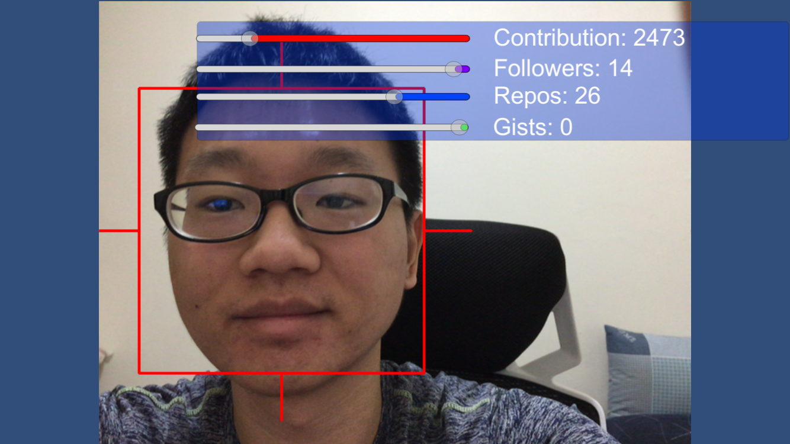

Scouter
===

Scouter: A human face detector which displays your Github contribution statistics.

[](https://travis-ci.org/chechiachang/scouter)




# Check Presentation Strem on COSCUP 2018

[Presentation On COSCUP 2018](https://github.com/chechiachang/my-speeches/blob/master/fr-ar-open-source-power-detector/presentation.md)

# Brief

- Fetch data with Github API
  - Github user data
  - Github user avatar
  - Parse Github contribution HTML to get user contribution statistics
- Convert avatar to identity with Face Recognition API. Encoding avatar identity with userId.
- Track face and crop face image from camera streaming with OpenCV
- Send face image to Flask API server
  - Convert unknown face image to identity.
  - Get userId and contribution statistics with identity.
- Send user contribution to App and display.

# MongoDB

1. Have a local running mongoDB using docker
```
make db
```

2. (Optional) Import dump user data
```
make migrate

# Check user data in mongodb
docker exec -it mongo mongo scouter --eval "printjson(db.users.findOne())"
docker exec -it mongo mongo scouter --eval "printjson(db.users.count())"
```

Skip 'Fetching data with Github API' if using dump data

# (Optional) Fetching data with Github API

### Generate Github access token

1. Github -> User -> settings -> Developer settings -> Personal access tokens
2. Keep your token safe.

### Run fetchers with token

0. Install go

1. Fetch user data with Github Search API
```
go build ./cmd/user_fetcher && ./user_fetcher -token <Github-API-token>
```

2. Fetch user detail information like follwers and repos with Github User API
```
go build ./cmd/user_detail_fetcher && ./user_detail_fetcher -token <Github-API-token>
```

3. Fetch users' avatar with user.url from data in mongodb
```
go build ./cmd/avatar_downloader && ./avatar_downloader
```

4. Fetch users' contribution statics by parsing html response of user.url from data in mongodb
```
go build ./cmd/contribution_fetcher && ./contribution_fetcher
```

5. Make sure user avatar are good to go
```
ls data/avatars
```

# Face detection and Face recognition

[Face Recognition API](https://Github.com/ageitgey/face_recognition)

0. Prepare a python virtual env
```
python3 -m venv .venv
source ./.venv/bin/activate
```

1. Install python dependency
```
pip3 install dlib flask face_recognition pymongo bson
```

2. Try some face recognition API
```
face_recognition --show-distance true --tolerance 0.54 ./pictures_of_people_i_know/ ./unknown_pictures/
```

3. Prepare face identity file with encoding generator
```
# Filter data/avatars image. Save images with human faces to data/human_face.
# Generate face_recognition/encodings and face_recognition/index with data/human_face
python ./face_recognition/encoding_file_generator.py
```

4. Run apiserver to serve face recognition API
```
python ./face_recognition/APIserver.py
```

# Unity

1. Download latest Unity with iOS Build tools

2. Create a new project

3. Download and import a free face tracker example from unity asset store
[Face Tracker Example](https://assetstore.unity.com/packages/templates/tutorials/facetracker-example-35284)

4. Download and import another priced asset is required: 
[OpenCV for Unity](https://assetstore.unity.com/packages/tools/integration/opencv-for-unity-21088)
NOTE: This is a priced asset.

5. Copy unity scenes and scripts
```
cp -r unity/Assets/Scouter/* <unity-workspace>/<your-project>/Assets/FaceTrackerExample
```

6. Open Unity and setup.
File -> Build Settings -> Player Settings
```
Mac App Store Options -> Bundle Identifier: com.chechiachang.scouter
Configuration -> Scriptin Runtime Version: .NET 4.x Equivalent -> restart
```

7. Open Scenes/WebCamTextureFaceTrackerExample
```
Inspector -> Web Cam Texture Face Tracker Example -> Apiserverip: 
- 127.0.0.1 on your localhost mac
- 172.20.10.3 with personal hotspot of Iphone
```
Run

### Project Configuration

1. Open unity build for iphone project with xcode. Open another project.
2. Xcode developer account:
  - Xcode - Preferences - Accounts: Add and login your 'apple developer ID'. 
  - The team of your developer account will show up. 
  - In my case, A personal team show up with my username as team name.
3. Signing:
  - Click my-project. The project configure page will show up.
  - General - Identity: Change your display name and Bundle Identifier. Any reasonable identifier other than the example identifier will work.
  - General - Signing: Check 'Automatically manage signing'.
  - Choose your team. A signing certificates will show up.
  - If you stuck here, check your bundle identifier.

### Build project

1. Attach your device (your iphone). Unlock your iphone.
2. Click 'Build and Run Current Schema'.

# TODOs

- [x] Github API crawler
  - [x] Add an API to search user in Taiwan 
    - [x] Order by joined asc
    - [x] Implement a API call with narrowed search condition
  - [x] Add an API to fetch user Data
    - [x] Get user with userUrl
    - [x] order by most follower
    - [x] order by most commit. Might need query by username.
  - [x] Save user data to mongodb
    - [x] username
    - [x] avatar
    - [x] # of follower
    - [x] # of contributions
- [x] Google Search API Face downloader
  - [x] Search Avatar with Github username and login
  - [x] Google Custom Search API
    [Google Custom Search API](https://developers.google.com/custom-search/docs/tutorial/introduction)
- [x] Face Recognizer
  - [x] Face detector
    - [x] Generate face encoding and save to Python Pickle file
    - [x] Face Recognition
      [Face recognition](https://Github.com/ageitgey/face_recognition)
- [x] Front-End
  - [x] Unity ios app
  - [x] API portal
  - [x] AR GUI
- [x] Readme


